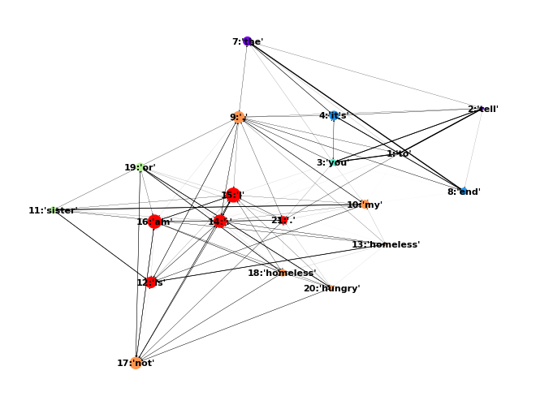

# BEACON

BERT Extracted Attention for Clinical Ontology aNnotation

# Overview
An exploration of building queriable concept relations from clinical text
through the use of pretrained BERT models and graph analysis.

> This project is under active development and will change frequently.

## Getting Started

Implemented in Python3. To install package using Pip:

```
$ pip3 install git+https://github.com/rz4/MinoTauro.git
$ pip3 install git+https://github.com/rz4/BEACON.git
```

Then import Beacon into your script like:

```python
import hy, json
from beacon import Beacon

CONCEPTS ="""
%--
fam_homeless(A, B) :-
  istype(A, fam),
  istype(B, homeless),
  undirected(A,B).

%--
negex_homeless(A, B) :-
  istype(A, negex),
  istype(B, homeless),
  undirected(A,B).

%--
self_homeless(A, B) :-
  istype(A, self),
  istype(B, homeless),
  undirected(A,B),
  not(fam_homeless(_,B)),
  not(negex_homeless(_,B)).
"""

QUERYS = {"test1":
            "self_homeless(A,B),\
             token(A,ATOKEN,ASTARTX,AENDX),\
             token(B, BTOKEN,BSTARTX,BENDX)",
          "test2":
            "fam_homeless(A,B),\
             token(A,ATOKEN,ASTARTX,AENDX),\
             token(B, BTOKEN,BSTARTX,BENDX)"}


if __name__ == "__main__":

  #- Load Text
  with open("examples/example_1.txt", "r") as f: text = f.read()

  #- Load Beacon With Pretrained Bert Model
  model = Beacon(targets=["homeless","housing","nohousing","livingsituation"],
                 context_len=12,
                 from_pretrained="bert-base-uncased",
                 layers=[4,5,6,7,8])

  #- Produce Text Abstract Syntax Tree (AST) From Bert Attention
  annotations = model(text)

  #- For each annotation
   for annotation in annotations:
       match, snippet, AST = annotation
       print("Matched '{}' Along '{}'".format(match, snippet))
       print("Bert Abstract Syntax Tree:\n{}\n".format(AST))

       #- Run Logical Query Using Prolog
       results = AST.query(QUERYS, priors=CONCEPTS)
       print("Query Results:\n{}".format(json.dumps(results, indent=4)))

"""
Matched 'homeless' Along 'to tell you it's the end. my sister is homeless. i am not homeless or hungry.'

Bert Abstract Syntax Tree:
[[["to" ["you" ["it's" ["the" "."]]]] ["tell" "end"]]
 [[["my" ["is" "."]] ["sister" "homeless"]]
  [["i" [["am" ["homeless" ["hungry" "."]]] "not"]] "or"]]]

Query Results:
{
    "test1": [],
    "test2": [
        {
            "A": 11,
            "B": 13,
            "ATOKEN": "sister",
            "ASTARTX": 29,
            "AENDX": 35,
            "BTOKEN": "homeless",
            "BSTARTX": 39,
            "BENDX": 47
        }
    ]
}
"""
```
## Example Scripts

- `python3 test_beacon.py` : Runs BEACON on `examples/example_1.txt`;

### Example 1: Building Facts w.r.t Homelessness From Text

This section shows how BEACON can be used to derive targeted facts about the patient and
a selected medical concept given an expert derived vocabulary and an out-of-the-box pretrained BERT language
model from HuggingFace. We are able to extract predicate rules which can be explored with the help of logic
programming to reduce the ambiguity of relations between vocabulary terms.

>> I am writing this quickly to tell you it's the end. My sister is homeless. I am not homeless or hungry.


#### Directed Graph Built from BERT Attention


BEACON extracts the activations from self-attention operations in BERT to build a
directed graph between tokens. For each token in BERT's representation,
we select those interdependent relations which influence high Gini inequality given the set
of possible token relations. The resulting graph is a subgraph of the fully connected attention graph
within BERT which have the strongest dependency between tokens. Unification is then applied
over the graph with respect to how BERT tokens maps tokens and subtokens.

```hy
[[["to"
    ["you"
      ["it's"
        ["the" "."]]]]
  ["tell" "end"]]
 [[["my"
    ["is" "."]]
   ["sister" "homeless"]]
  [["i"
    [["am"
      ["homeless"
       ["hungry" "."]]]
     "not"]]
   "or"]]]
```

The directed graph show organization in the form of communities of tokens
with strong interdependence. In the plot of the graph, these communities
are colored via subgraph discovery. We use the Girvan-Newman algorithm
for divisive graph partitioning to build a hierarchical representation
of the text. A binary tree of tokens can be compiled which best preserves
the clustering of the tokens in the directed graph.


#### SWI-Prolog Script Derived From Directed Graph

A interesting structural property of the above binary tree is the locality
of terms which have some dependence on one another. For example, the term
`homeless` is present in two sentences, but each reference is localized
in separate subtrees which are related to each referenced token's context.
This property can be used to build predicate facts around our vocabulary terms.
We compile the binary tree to SWI-Prolog.


```prolog
%-- BERT-Parse Derived Facts:

% token(index, token, startx, endx).

token(1, "to", 0, 2).
token(2, "tell", 3, 7).
token(3, "you", 8, 11).
token(4, "it's", 12, 14).
token(7, "the", 17, 20).
token(8, "end", 21, 24).
token(9, ".", 24, 25).
token(10, "my", 26, 28).
token(11, "sister", 29, 35).
token(12, "is", 36, 38).
token(13, "homeless", 39, 47).
token(14, ".", 47, 48).
token(15, "i", 49, 50).
token(16, "am", 51, 53).
token(17, "not", 54, 57).
token(18, "homeless", 58, 66).
token(19, "or", 67, 69).
token(20, "hungry", 70, 76).
token(21, ".", 76, 77).

% tree(index, node1, node2).

tree("_G￿16", 7, 9).
tree("_G￿15", 4, "_G￿16").
tree("_G￿14", 3, "_G￿15").
tree("_G￿13", 1, "_G￿14").
tree("_G￿17", 2, 8).
tree("_G￿12", "_G￿13", "_G￿17").
tree("_G￿21", 12, 14).
tree("_G￿20", 10, "_G￿21").
tree("_G￿22", 11, 13).
tree("_G￿19", "_G￿20", "_G￿22").
tree("_G￿28", 20, 21).
tree("_G￿27", 18, "_G￿28").
tree("_G￿26", 16, "_G￿27").
tree("_G￿25", "_G￿26", 17).
tree("_G￿24", 15, "_G￿25").
tree("_G￿23", "_G￿24", 19).
tree("_G￿18", "_G￿19", "_G￿23").
tree("_G￿11", "_G￿12", "_G￿18").
```

By searching local subtrees for dependent terms, we can test for the presence
of language modifiers dependencies on terms. The example_1 script defines a
query that searches for a self-identifier token that is dependent on
a homeless token which isn't dependent on a negation token or a family-identifier
token.

```prolog
%--
fam_homeless(A, B) :-
  istype(A, fam),
  istype(B, homeless),
  undirected(A,B).

%--
negex_homeless(A, B) :-
  istype(A, negex),
  istype(B, homeless),
  undirected(A,B).

%--
self_homeless(A, B) :-
  istype(A, self),
  istype(B, homeless),
  undirected(A,B),
  not(fam_homeless(_,B)),
  not(negex_homeless(_,B)).
```
